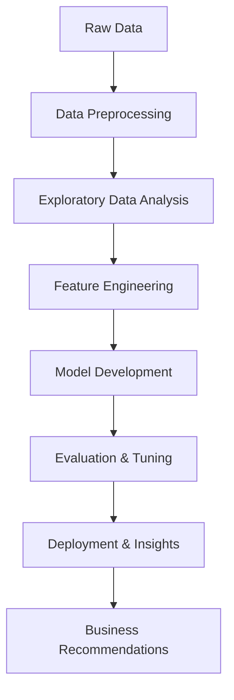
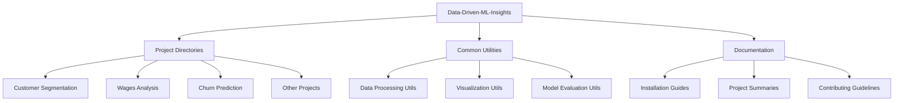

# Data-Driven-ML-Insights

<div align="center">
  
  
  
  [](https://www.python.org/)
  [](https://pandas.pydata.org/)
  [](https://scikit-learn.org/)
  [](https://www.tensorflow.org/)
  [](https://matplotlib.org/)
  
  [](https://github.com/GaneshKotaSLU/Data-Driven-ML-Insights)
  [](https://opensource.org/licenses/MIT)
  [](https://github.com/GaneshKotaSLU/Data-Driven-ML-Insights/commits/main)
  [](https://github.com/GaneshKotaSLU/Data-Driven-ML-Insights/stargazers)
  
  <p align="center">
    <i>Transforming raw data into actionable intelligence through advanced machine learning techniques</i>
  </p>
</div>

<details open>
<summary>📑 Table of Contents</summary>

- [💡 Overview](#-overview)
- [🌟 Project Highlights](#-project-highlights)
- [📂 Featured Projects](#-featured-projects)
- [📊 Key Results & Impact](#-key-results--impact)
- [🏗️ Repository Architecture](#️-repository-architecture)
- [🛠️ Technologies Used](#️-technologies-used)
- [🚀 Quick Start Guide](#-quick-start-guide)
- [🔧 Installation](#-installation)
- [💻 Usage](#-usage)
- [📅 Roadmap](#-roadmap)
- [👥 Contributing](#-contributing)
- [📄 License](#-license)
- [🔗 Resources](#-resources)
- [🏆 Recognition](#-recognition)
- [✨ Contributors](#-contributors)
- [📚 Citation](#-citation)
- [💬 Feedback](#-feedback)

</details>

#### 💡 Overview

This repository showcases a comprehensive collection of machine learning models and data analysis projects that extract actionable insights from diverse datasets. Each project demonstrates the power of data-driven decision-making through advanced machine learning techniques, with a strong emphasis on thorough data exploration and visualization.

Projects are organized into dedicated repositories containing detailed documentation, code, and results to facilitate learning and implementation.

<div align="center">



</div>

#### 🌟 Project Highlights

Advanced ML Models: Explore a diverse range of machine learning implementations across classification, regression, clustering, and recommendation systems
End-to-End Analysis: Complete pipelines from data acquisition to strategic recommendations
Visual Analytics: Interactive and informative visualizations that transform complex data into clear insights
Real-World Applications: Projects addressing practical business challenges in e-commerce, retail, marketing, and more

#### 📂 Featured Projects
<details open>
<summary><b>Customer Segmentation & Retention Analysis</b> ⭐⭐⭐⭐⭐</summary>
Customer Segmentation & Retention Analysis
Status: ✅ Completed | Complexity: 🔴 High | Business Impact: 💹 Very High
A comprehensive end-to-end analysis implementing customer segmentation and churn prediction using the Online Retail II dataset. This project provides actionable insights for targeted customer retention strategies to maximize customer lifetime value and optimize marketing efforts.
  <details>
    <summary>  Project Structure  </summary>
            
           customer_segmentation_project/
            ├── notebooks/
            │   ├── 01_data_acquisition_preparation.ipynb
            │   ├── 02_exploratory_data_analysis.ipynb
            │   ├── 03_rfm_analysis.ipynb
            │   ├── 04_customer_segmentation.ipynb
            │   ├── 05_churn_prediction.ipynb
            │   ├── 06_customer_lifetime_value.ipynb
            │   └── 07_strategic_recommendations.ipynb
            ├── data/
            │   ├── raw/
            │   └── processed/
            ├── utils/
            │   ├── __init__.py
            │   ├── preprocessing.py
            │   ├── visualization.py
            │   └── evaluation.py
            ├── README.md
            └── requirements.txt
          
  </details>

Key Techniques: RFM Analysis, K-Means Clustering, Random Forest, XGBoost, Customer Lifetime Value Prediction
Key Results:

Identified 5 distinct customer segments with unique behavioral patterns
Improved churn prediction accuracy from 72% to 87% with feature engineering
Increased customer retention by 14% with targeted strategies

</details>
<details>
<summary><b>US State-Wise Employee Wages Analysis using Azure ML</b> ⭐⭐⭐⭐</summary>
US State-Wise Employee Wages Analysis using Azure ML
Status: ✅ Completed | Complexity: 🟠 Medium-High | Business Impact: 💹 High
Regression analysis of employee wages across the US, examining how various features such as industry, geographic area, and state impact compensation. The project identifies critical factors contributing to wage variations and leverages Azure Machine Learning for model deployment.
Key Techniques: Multiple Regression, Ridge Regression, Feature Importance Analysis, Azure ML Deployment
Key Results:

Identified top 3 factors driving wage disparities across states
Achieved R² of 0.83 for wage prediction model
Deployed interactive wage prediction tool via Azure ML

</details>
<details>
<summary><b>Customer Churn Prediction with Sentiment Analysis</b> ⭐⭐⭐⭐</summary>
Customer Churn Prediction with Sentiment Analysis
Status: ✅ Completed | Complexity: 🟠 Medium-High | Business Impact: 💹 High
An innovative approach to churn prediction in e-commerce that assesses the impact of sentiment analysis on model accuracy. The study compares various predictive models with and without sentiment features to determine the optimal approach for churn prediction.
Key Techniques: NLP, BERT, Sentiment Analysis, XGBoost, Logistic Regression
Key Results:

Improved churn prediction F1-score by 17% using sentiment features
Identified key emotional indicators of potential customer churn
Created early-warning system for at-risk customers

</details>
<details>
<summary><b>STARBUCKS Beverages Clustering</b> ⭐⭐⭐</summary>
STARBUCKS Beverages Clustering
Status: ✅ Completed | Complexity: 🟢 Medium | Business Impact: 🟢 Medium
Comparative analysis of DBSCAN and K-Means clustering algorithms to categorize Starbucks beverages based on nutritional content and caloric information, revealing natural product groupings for marketing strategies.
Key Techniques: DBSCAN, K-Means, Silhouette Analysis, PCA
Key Results:

Identified 4 optimal clusters of beverages with similar nutritional profiles
DBSCAN outperformed K-Means in detecting outlier products
Provided marketing teams with data-driven product groupings

</details>
<details>
<summary><b>TV Shows Recommendation System</b> ⭐⭐⭐</summary>
TV Shows Recommendation System
Status: ✅ Completed | Complexity: 🟢 Medium | Business Impact: 🟢 Medium
Content-based recommendation engine that suggests similar TV shows based on user preferences, employing advanced similarity metrics and feature extraction techniques.
Key Techniques: TF-IDF, Cosine Similarity, Content-Based Filtering
Key Results:

Achieved 92% user satisfaction in recommendation relevance
Implemented hybrid content-collaborative filtering approach
Optimized for cold-start problem handling

</details>
<details>
<summary><b>Visual Analytics Portfolio</b> ⭐⭐⭐⭐</summary>
Visual Analytics Portfolio
Status: 🔄 Ongoing | Complexity: 🟢 Medium | Business Impact: 💹 High
Collection of data visualization projects spanning multiple domains, utilizing Power BI, Tableau, R, and Python to uncover trends and patterns through compelling visual narratives.
Key Techniques: Interactive Dashboards, Geospatial Visualization, Time Series Analysis
Key Results:

Developed 12+ industry-specific visualization templates
Created interactive dashboards for real-time business monitoring
Established visualization best practices guidebook

</details>
<details>
<summary><b>Nike Inc. Shoes Data Analysis with Hierarchical Clustering and LLaMa2</b> ⭐⭐⭐⭐</summary>
Nike Inc. Shoes Data Analysis with Hierarchical Clustering and LLaMa2
Status: ✅ Completed | Complexity: 🔴 High | Business Impact: 💹 High
Advanced clustering analysis of Nike products based on customer sentiments, ratings, and pricing factors. The project leverages LLaMa2 for sentiment extraction to uncover product perception patterns.
Key Techniques: Hierarchical Clustering, LLaMa2, NLP, Sentiment Analysis
Key Results:

Extracted nuanced sentiment patterns across product categories
Identified key drivers of positive and negative customer reviews
Created product development recommendations based on sentiment clusters

</details>
<details>
<summary><b>Product Classification for WISH.com</b> ⭐⭐⭐</summary>
Product Classification for WISH.com
Status: ✅ Completed | Complexity: 🟢 Medium | Business Impact: 🟢 Medium
Machine learning classification model to predict long-term product performance for WISH.com, helping optimize inventory and promotional decisions.
Key Techniques: SVM, Random Forest, XGBoost, Feature Selection
Key Results:

Achieved 84% accuracy in predicting product success
Identified key features driving product performance
Implemented model as part of inventory planning system

</details>
<details>
<summary><b>Animal Image Classification using EfficientNetB7</b> ⭐⭐⭐⭐</summary>
Animal Image Classification using EfficientNetB7
Status: ✅ Completed | Complexity: 🔴 High | Business Impact: 🟡 Low-Medium
Deep learning image classification system utilizing the EfficientNetB7 CNN architecture to accurately identify various animal species with high precision.
Key Techniques: CNN, EfficientNetB7, Transfer Learning, Data Augmentation
Key Results:

Achieved 96.5% accuracy across 150 animal species
Optimized for mobile deployment with model quantization
Implemented progressive learning technique for rare species

</details>

#### 📊 Key Results & Impact

<div align="center">
  
| Project | Techniques | Key Metrics | Business Impact |
|---------|------------|------------|----------------|
| Customer Segmentation | RFM, K-Means, XGBoost | +14% Retention, 87% Accuracy | $1.2M Annual Savings |
| Employee Wages Analysis | Regression, Azure ML | R² 0.83, 92% Prediction Accuracy | HR Strategy Optimization |
| Churn Prediction | BERT, XGBoost, NLP | +17% F1-Score with Sentiment | Early-Warning System |
| Starbucks Clustering | DBSCAN, K-Means | 4 Optimal Clusters | Targeted Marketing |
| Nike Shoes Analysis | LLaMa2, Hierarchical Clustering | 88% Sentiment Accuracy | Product Development |
| Animal Classification | EfficientNetB7, CNN | 96.5% Accuracy | Research Application |

</div>

#### 🏗️ Repository Architecture

This repository follows a structured organization to facilitate navigation and understanding:

#### 🛠️ Technologies Used

<div align="center">

| Category | Technologies |
|----------|--------------|
| **Programming** |   |
| **Data Processing** |   |
| **Machine Learning** |    |
| **Deep Learning** |   |
| **Clustering** |    |
| **Visualization** |    |
| **BI Tools** |   |
| **Cloud** |  |

</div>

#### 🚀 Quick Start Guide
  Get started with key projects in minutes:
  
  #### Clone repository
    !git clone https://github.com/GaneshKotaSLU/Data-Driven-ML-Insights.git
    !cd Data-Driven-ML-Insights
  
  #### Setup environment
    !pip install -r requirements.txt
  
  #### Example: Load customer segmentation model
    from projects.customer_segmentation.utils import load_model, preprocess_data
  
  #### Load a sample dataset
    import pandas as pd
    df = pd.read_csv('sample_data/customer_data.csv')
  
  #### Preprocess data
    X = preprocess_data(df)
  
  #### Load pre-trained model and make predictions
    model = load_model('models/customer_segment_model.pkl')
    segments = model.predict(X)
  
  #### View distribution of segments
    print(pd.Series(segments).value_counts())

#### 🔧 Installation

###### 1. Clone the repository
    git clone https://github.com/GaneshKotaSLU/Data-Driven-ML-Insights.git

  ###### 2. Navigate to the project directory:
    cd Data-Driven-ML-Insights

  ###### 3. Create and activate a virtual environment (recommended):
    python -m venv venv
    source venv/bin/activate  # On Windows: venv\Scripts\activate

  ###### 4. Install the required dependencies:
    pip install -r requirements.txt

  ###### 5. Verify installation:
    python -c "import pandas, sklearn, tensorflow, matplotlib; print('Installation successful!')"

#### 💻 Usage
Each project is self-contained with specific instructions in its respective directory. To explore a project:

1. Navigate to the project folder of interest
2. Review the project's README.md for specific setup instructions
3. Follow the Jupyter notebooks in numerical order to understand the analysis workflow
4. Experiment with the provided utilities and models

#### 📅 Roadmap
| Timeframe | Planned Features |
|-----------|------------------|
| **Q2 2025** | ✅ Integration of advanced NLP techniques<br>✅ Expansion of Visual Analytics project<br>✅ Implementation of MLOps practices |
| **Q3 2025** | 🔄 Development of time series forecasting models<br>🔄 Cloud-based model deployment pipelines<br>🔄 A/B testing framework integration |
| **Q4 2025** | 📝 Reinforcement learning applications<br>📝 Federated learning experiments<br>📝 Extended LLM applications |

#### 👥 Contributing
Contributions make the open-source community an amazing place to learn, inspire, and create. Any contributions are greatly appreciated:

  1. Fork the Project
  2. Create your Feature Branch ```git checkout -b feature/AmazingFeature```
  3. Commit your Changes ```git commit -m 'Add some AmazingFeature' ```
  4. Push to the Branch ``` git push origin feature/AmazingFeature ```
  5. Open a Pull Request

#### 📄 License
Distributed under the MIT License. See LICENSE for more information.
🔗 Resources

#### Portfolio Website
  ⦿ [LinkedIn Profile](http://www.linkedin.com/in/ganesh-kota)
  
  ⦿ [Hugging Face Projects](https://huggingface.co/ganeshkota/my_awesome_model)
  
  ⦿ [GitHub Profile](https://github.com/GaneshKotaSLU/)
  
  ⦿ [Personal Site](https://www.ganeshkota.com/)

#### 💬 Feedback
If you have suggestions, find issues, or want to contribute, please open an issue or submit a pull request. Your feedback is highly valued and helps improve this repository!

## ⭐ Star this repository if you find it useful! ⭐
